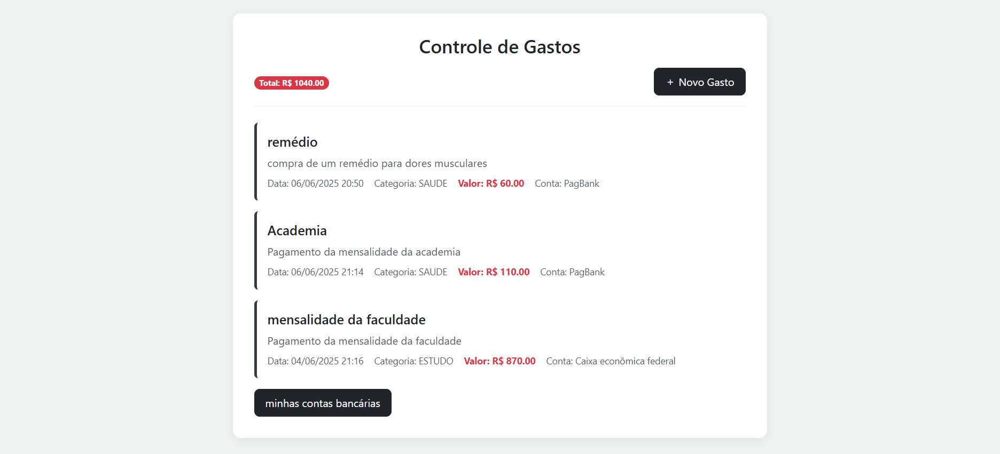
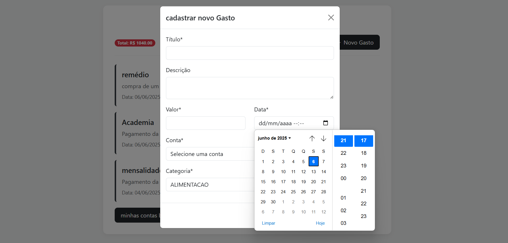
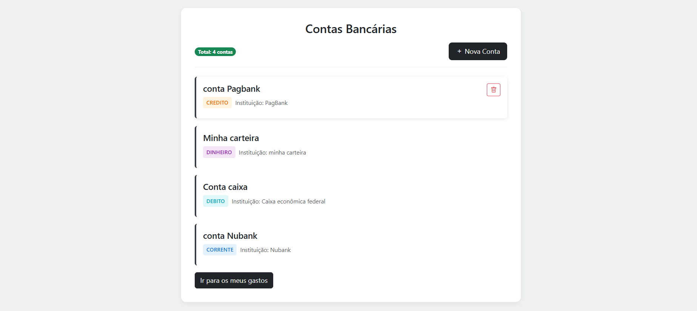
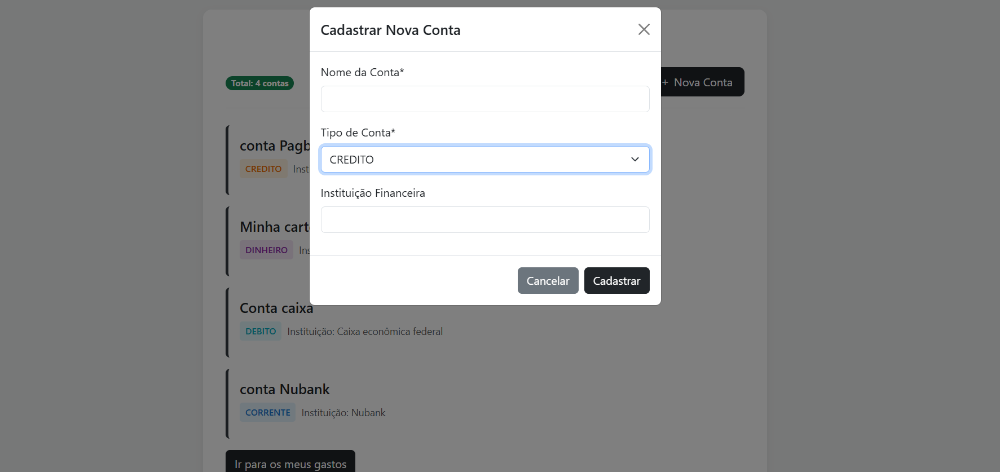

# Web Finance - Controle financeiro

<p align="center">
 <br>
    
    
</p>
Web Finance é uma aplicação desenvolvida com o 
padrão de arquitetura MVC que permite ao usuário 
gerenciar seus gastos e suas contas bancárias.

##  📷 Visão Geral
A proposta do projeto surgiu após
algumas discussões sobre temas de projetos
para um trabalho universitário e foi decidido
que seria desenvolvido um sistema de controle 
financeiro. O resultado obtido foi uma aplicação
onde o usuário poderá cadastrar seus gastos e ter 
mais controle sobre suas finanças e também conta
com uma aba apenas para registrar suas contas bancárias
onde o mesmo poderá definir qual foi a conta que teve
determinado gasto.

## 🚀 Funcionalidades

- ✅ cadastro de gastos
- 💳 cadastro de contas
- exclusão de ambos (Se uma conta for excluida,
todos os gastos serão excluídos juntamente)

## 🧱 Arquitetura
O projeto segue o padrão MVC **(Model - View - Controller)**,
promovendo separação de responsabilidades e facilidade
na manutenção de código.

## 🛠️ Tecnologias Utilizadas

### Back-end
- **Java 21**
- **Spring Boot**
- **Spring Data JPA**
- **Hibernate**
- **Banco de dados PostgreSQL**

### Front-end
- **HTML5**
- **CSS3**
- **Bootstrap**
- **Thymeleaf**

## 📁 Estrutura de Pastas

```
src/
├── main/
│ ├── java/
│ │ └── com.project.controle
│ │ ├── controller/
│ │ ├── model/
│ │  └── Enum/
│ │ ├── repository/
│ │ ├── service/
│ └── resources/
│ ├── static/
│ ├── templates/
│ └── application.yml
```

## 📷 Evidências visuais

- **Controle de gastos:**



- **Cadastrar gastos:**



- **Contas:**
  

- **Cadastrar Contas:**
  